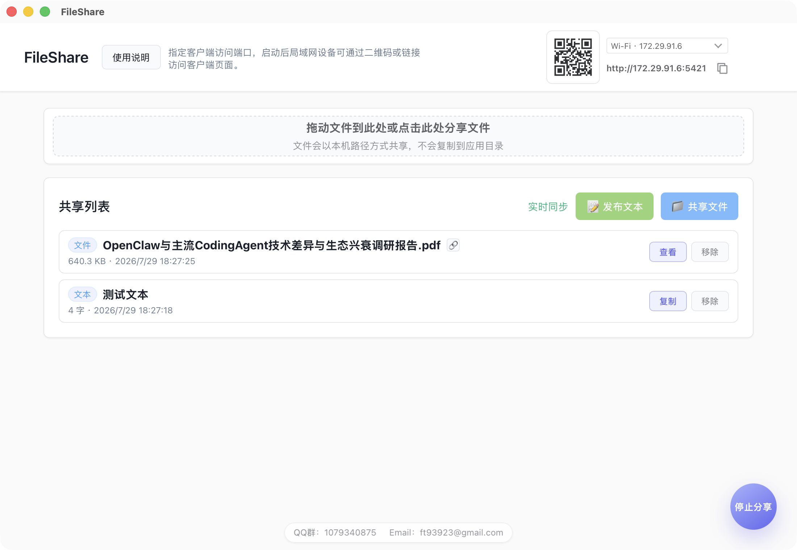

# FileShare

一个基于 Tauri 的局域网文件共享工具。

项目分成三层：

- 管理端：Tauri 桌面 GUI，负责启动/停止局域网共享、选择本机文件、下载文件、托盘控制
- 内嵌服务：Rust HTTP 服务，负责客户端页面、接口、SSE、文件下载、客户端上传保存和元数据持久化
- 客户端：局域网 Web 页面，负责上传文本、上传文件、下载文件、复制文本和复制下载链接

管理端可以共享本机文件和发布文本；客户端可以上传文件到服务端用户的 `Downloads` 目录，也可以发布文本。双方的共享列表会实时同步。



## 下载

如果你只是想直接使用应用，请前往 GitHub Releases 页面下载已经打包好的安装包：

[GitHub Releases](https://github.com/tri5m/file-share/releases)

macOS 如果提示“FileShare 已损坏，无法打开”，通常是因为应用未签名或未公证。可以先把应用拖到 `/Applications`，然后打开 macOS 自带的「终端」应用，在终端窗口中执行：

```bash
xattr -dr com.apple.quarantine /Applications/FileShare.app
```

执行完成后，再重新打开应用。

macOS `.dmg` 安装包内也会附带一个名为“损坏修复”的可执行文件。把 `FileShare.app` 拖到 `/Applications` 后，也可以双击这个文件完成同样的修复。

## 开发环境

- Node.js
- Rust / Cargo
- Tauri 对应平台依赖

## 安装依赖

```bash
npm install
```

## 启动开发

```bash
npm run dev
```

启动后会打开 Tauri 管理端窗口。输入端口并点击“启动服务”后，客户端才可以通过局域网地址访问。

桌面端在 macOS 菜单栏和 Windows 系统托盘中提供后台入口，关闭窗口后只隐藏到后台，不直接退出。

开发模式说明：

- 当前前端静态资源位于 `public/`
- Rust 服务通过 `include_str!` 内嵌这些文件
- 修改 `public/` 下文件后，需要重启一次 `npm run dev`，最新前端资源才会重新编译进应用

## 接口说明

- `/` 和 `/client.html` 都会返回客户端页面
- `/api/share-info` 返回局域网客户端访问链接和二维码
- `/api/local-file` 和 `DELETE /api/items/:id` 只允许服务端本机访问，供管理端使用
- `/api/client-info` 是本机管理信息接口，当前管理端前端不直接依赖它

## 构建打包

```bash
npm run build
```

打包完成后，产物默认会出现在 `src-tauri/target/release/bundle/` 目录下。

启用自动更新后，打包需要提供 Tauri updater 签名私钥。当前项目本机生成的私钥位于 `.updater/file-share.key`，这个目录已加入 `.gitignore`，不要提交到仓库。

GitHub Actions 发布前，需要在仓库 Settings -> Secrets and variables -> Actions 中添加：

- `TAURI_SIGNING_PRIVATE_KEY`：`.updater/file-share.key` 的原始完整内容，直接复制文件里的 base64 字符串，不要解码，也不要使用 `.updater/file-share.key.pub`
- `TAURI_SIGNING_PRIVATE_KEY_PASSWORD`：如果私钥设置了密码再填写；当前生成的私钥没有密码，可以不填

## 自动发布

仓库包含 GitHub Actions 发布流程。推送 `v*` 标签时，会自动构建：

- macOS Apple Silicon `.dmg`
- macOS Intel `.dmg`
- Windows x86 安装包
- 自动更新所需的更新包、签名文件和 `latest-*.json`

构建完成后，产物会上传到对应的 GitHub Release。

已安装的桌面应用可以通过系统托盘菜单里的“检查更新”获取新版本。局域网 Web 客户端不需要单独更新，刷新页面即可使用当前桌面应用内置的新客户端页面。
